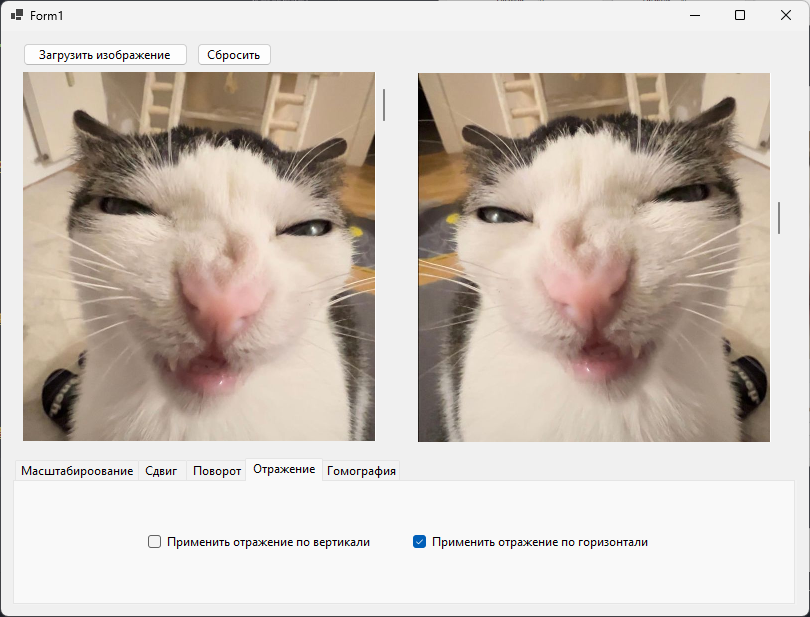

# Цель работы: 
Целью данной работы является изучение базовых операций над геометрией изображений и их применение к некоторым задачам обработки изображений.

# Основные задачи:
Необходимо разработать приложение Windows Forms, способное осуществлять:
1.	загрузку и отображение двух изображений по выбору пользователя;
2.	возможность применения аффинных преобразований к загруженным изображениям;
3.	возможность проекции области одного изображения на другое;

# Задание:
Разработать программу, позволяющую отображать в одном окне два изображения: оригинальное изображение слева и результат обработки справа. Реализовать интерфейс, позволяющий по нажатию на соответствующие кнопки выполнять следующие операции:
1.	масштабирование изображения с параметрами, вводимыми пользователем. Размер результирующего изображения должен изменяться в соответствии с параметрами масштабирования;
2.	осуществлять сдвиг изображения на произвольное значение;
3.	поворот изображения относительно выбранной пользователем точки на заданный пользователем угол;
4.	отражение изображения одним из четырёх способов. При отражении, размер результирующего изображения не должен изменяться;
5.	применить билинейную фильтрацию при выполнении поворота и масштабирования для устранения графических дефектов;
6.	осуществить проекцию фрагмента изображения на произвольную плоскость. Добавить возможность выбора фрагмента и плоскости пользователем через указание четырёх точек с помощью мыши.

# Результат:
## Масштабирование
Масштабирование по X

  

Масштабирование по Y

  

## Сдвиг
Сдвиг лево

  

Сдвиг низ

  

## Поворот

Поворот 45 низ лево

  

Пользовательская точка

  

Поворот 90 по пользовательской точке

  

## Отражение

Отражение по горизонтали

  

Отражение по диагонали

  

## Гомография

Выбор плоскости

  

Гомография книги (есть проблемы с поворотом и масштабом)

  

